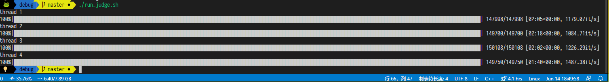

# 《使用 MVCC 实现事务并发控制》作业报告

## 实现方法

我使用了 C++ 模拟了一个数据库，并成功模拟了并发事务执⾏。

为了实现并发事务执，我选择了链表作为底层 Key-Value 存储结构。

同时，程序采取了单进程多线程的方式模拟了多并发的情况，所以内存一直是被共享着的。

具体实现中，在一个事务 BEGIN 的时候，程序统计得到当前已经 commit 成功的事务集合 $S$，而当前事务就只能 READ 到事务集合 $S$ 所 commit 的数据，忽视其他在 BEGIN 后才 commit 成功的数据，避免不可重复读。对于 SET 操作同样也只在能 READ 到的数据上修改，同时缓存当前未 commit 的数据，避免脏读。对于写操作，程序内部加上了写写锁机制，防止多个线程同时对数据进行修改从而产生错误。

## 实验结果

程序在多线程并发的环境中成功有效避免脏读和不可重复读，获得了正确的输出。

效率方面，单线程处理单份数据的耗时是 1.7s，四线程处理四份数据的耗时是 2.1s。其耗时的增加可能更多是因为写写锁的机制，导致某些线程在等待锁的时候花费了一些时间，但整体上效果还是很不错的。

## 不足

因为测试数据只有 SET 和 READ 两种操作，所以程序并没有考虑如何解决幻读问题。

## 代码文档

- `main.cpp`：主程序（含注释）
- `inputs/*.txt`：测试样例

可直接执行 `make` 进行编译。

执行 `./main x` 运行多线程版本，线程数为 `x`，若该参数为空则默认为 1。 

