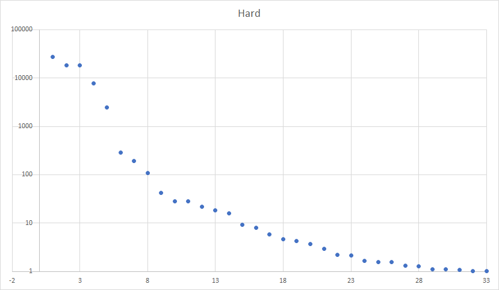

# 《估计 SQL 查询的行数》作业报告

## 实现方法

首先对数据库进行预处理，统计每一列的数据分布情况。这里分两种情况：

- 若数值种类数不超过 10000 则直接记录每种数值出现次数，保证数据的准确性。
- 若数值种类数大于 10000 则随机采样 10000 个数据并记录。

实验中不用直方图的原因是我觉得直方图和随机采样效果差别不大，实际上实验结果在和其他同学比较后也证实了这一点。

假设每个 where 子句彼此独立，则可以对每个 where 子句单独求得一个概率 $p$（即有多少数据满足此 where 子句），然后对所有 where 子句的概率求积，再乘上无条件限制下多表 join 后数据项的数量，则是当前 SQL 查询的估计行数。

where 子句。

## 实验结果

三个测试集所耗费的时间如下：

三个测试集的估计准确率如下：

## 不足

对于 join 方面，程序并没有进行特殊处理，实际上可以通过 where 子句中的等式建立起一个连通集，从而更准确地估计 SQL 行数。

## 代码文档

- `main.py`：主程序（含注释）
- `relate.py`：对经常出现在 SQL 中的比较大小 where 子句提前预处理
- `analyse.py`：分析估计准确率

可直接执行 `python3 main.py` 运行程序。

